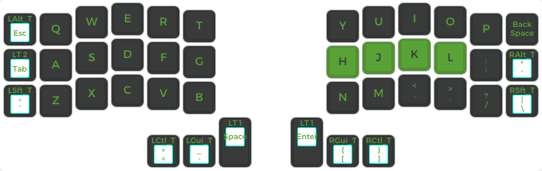

# James's Corne Keyboard Layout

## Layer 0: Main
All main keys including `-_=+[{]}~` can be accessed directly



## Layer 1: Number and Function
All number based keys and most function keys are included


## Layer 2: Mouse and Arrows
Control arrows with the left hand and mouse cursor via the right hand


## Layer 3: Mouse and Arrows
Keyboard settings


---

```
make crkbd/rev1:james:default
```
